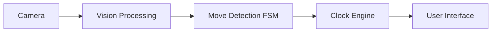
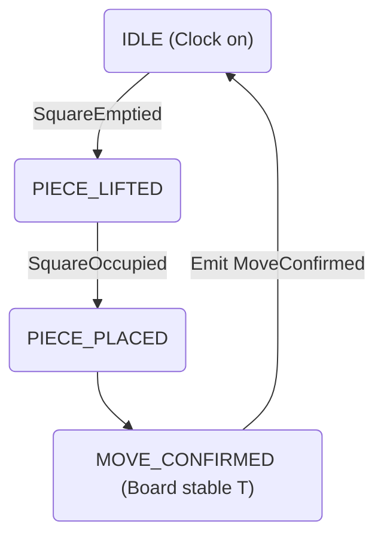

# Automatic Chess Clock — High-Level Software Architecture

### 1. Purpose and Scope

This document describes the high-level software architecture for an automatic chess clock implemented on a Raspberry Pi with a camera. The system detects completed chess moves using computer vision and automatically switches the active player's clock.

This design focuses on robust timekeeping, deterministic behavior, and simplicity. Detailed move legality, engine integration, and advanced UI features are explicitly out of scope for the initial version.

### 2. Design Goals

- Accurate and uninterrupted timekeeping
- Robust detection of completed moves
- Tolerance to piece adjustment and transient motion
- Support for fast time controls (blitz and bullet)
- Clear separation of responsibilities
- Testable and extensible architecture

### 3. Architectural Overview

The system is a multi-threaded, event-driven application. Each major responsibility runs in a dedicated thread and communicates only via timestamped events on bounded, thread-safe queues.

High-level data flow:

No component bypasses this flow.

### 4. Concurrency Model

Each thread owns its internal state and does not directly access other threads' state. Communication is done via bounded queues carrying timestamped events. This keeps ordering deterministic and isolates timing-critical logic.

#### Thread responsibilities

| Thread | Responsibility |
|---|---|
| Vision Thread | Capture frames and detect square occupancy changes |
| FSM Thread | Interpret board events and confirm completed moves |
| Clock Thread | Maintain and update player clocks (monotonic source) |
| UI Thread | Display clock state and accept user input |

Event flow is strictly unidirectional: Vision → FSM → Clock → UI.

### 5. Vision Abstraction

The vision subsystem intentionally does not identify piece types or validate chess rules. It reports binary occupancy per square:

- OCCUPIED
- EMPTY

When a square's occupancy changes, the Vision Thread emits an event to the FSM Thread. This simplification improves robustness under varying lighting and player behavior.

### 6. Move Detection State Machine (FSM)

Move detection is modeled as a finite state machine that captures the temporal sequence of a physical chess move.

#### States

| State | Description |
|---|---|
| IDLE | Board stable; active player's clock is running |
| PIECE_LIFTED | A piece has been removed from a square |
| PIECE_PLACED | A piece has been placed on a square |
| MOVE_CONFIRMED | A move has been completed and accepted |

#### Input events

- Square becomes EMPTY
- Square becomes OCCUPIED
- Board remains stable for configurable duration T

#### Output events

- MoveConfirmed

#### FSM diagram

##### FSM behavior notes

- Piece adjustment (lifting and replacing a piece on the same square) returns the FSM to IDLE without switching the clock.
- The clock switches exactly once per confirmed move.
- Move legality is not enforced by the FSM.
- Stability duration T is configurable to support different play speeds.

### 7. Clock Engine

The Clock Thread uses a monotonic time source and is independent from vision processing. It must guarantee accurate time tracking regardless of vision latency.

Responsibilities:

- Track remaining time for each player
- Switch the active player on MoveConfirmed
- Apply increments and handle pauses
- Emit periodic time updates to the UI

Clock accuracy is never affected by vision processing delays.

### 8. User Interface

The UI Thread handles presentation and user input only. It should never be a source of truth for timekeeping or move detection.

Responsibilities:

- Display remaining time and active player
- Show system status and errors (e.g., vision failure)
- Accept configuration input (time control, increment, sensitivity)

### 9. Failure & Edge Case Handling

- Vision failure: move detection is paused, but the clock continues to run normally.
- Transient motion and hand hovering are absorbed by FSM stability logic (configurable T).
- Event queue backpressure prevents uncontrolled memory growth; system must drop or compact old events if the queue overflows according to policy.
- System behavior remains deterministic under all input conditions.

### 10. Out of scope

- Enforcing move legality or integrating a chess engine
- Piece recognition (type/color)